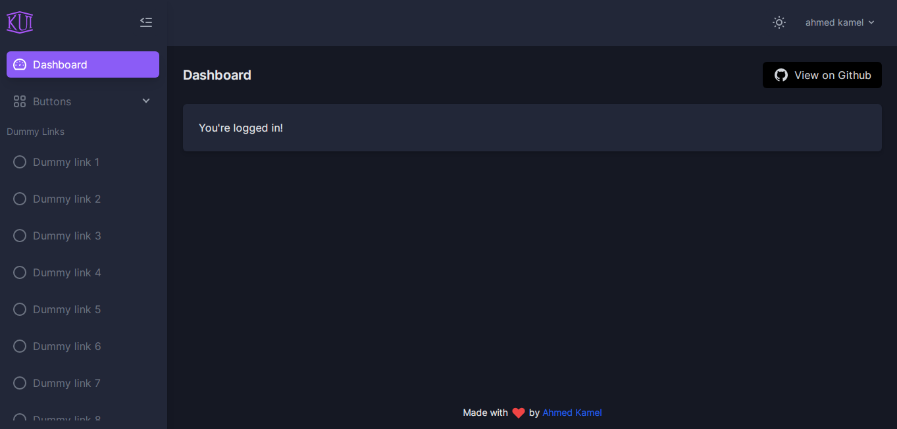
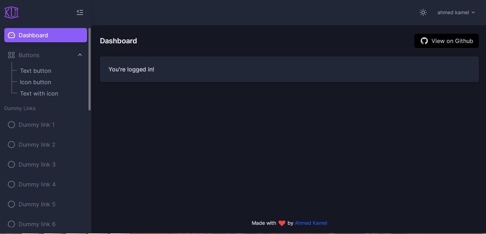
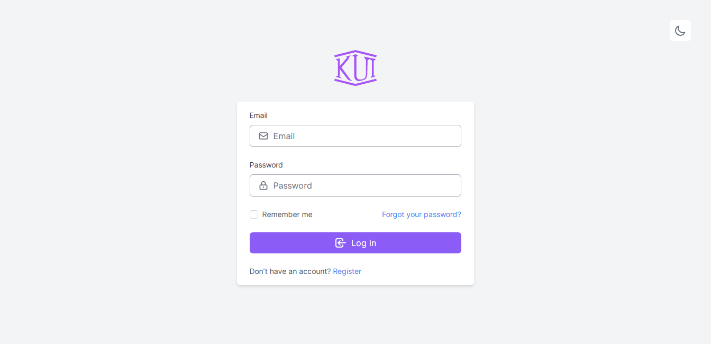
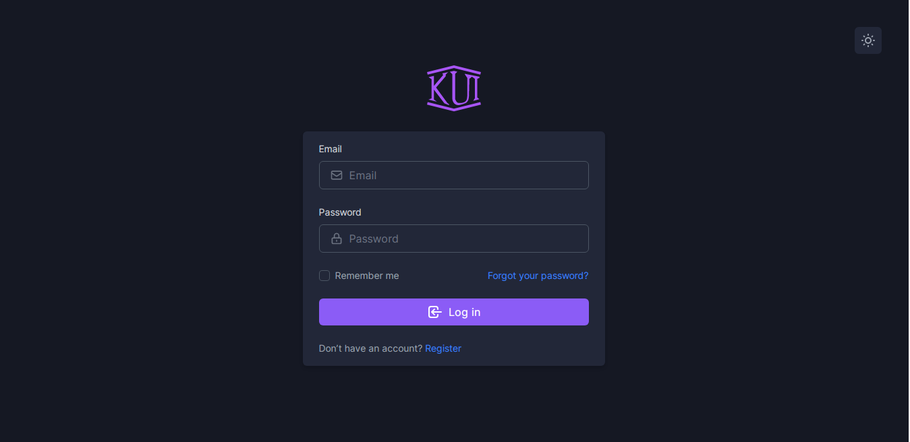
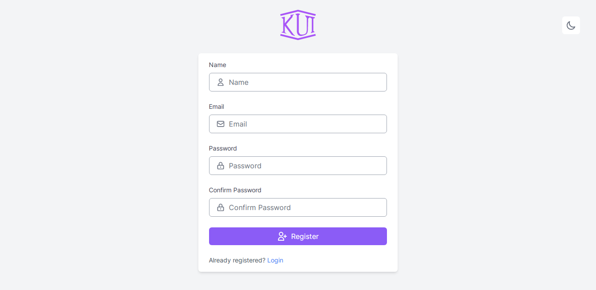
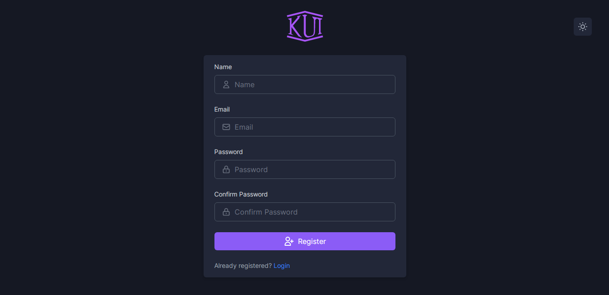

# K UI Breeze starter

Different UI for [larave/breeze](https://github.com/laravel/breeze).

[](https://github.com/Kamona-WD/kui-laravel-breeze/blob/main/LICENSE.md)
[](https://github.com/Kamona-WD/kui-laravel-breeze/releases)
[](https://github.com/Kamona-WD/kui-laravel-breeze/stargazers)
[](https://packagist.org/packages/kamona/kui-laravel-breeze)

#### [Jetstream Version](https://github.com/Kamona-WD/kui-laravel-jetstream)

<!-- #### [Fortify Version](https://github.com/Kamona-WD/kui-laravel-fortify) -->

#### Note

We recommend installing this package on a project that you are starting from scratch.

#### Usage

> **_note_** It doesn't matter if you use `vitejs` or `laravel-mix`, it will work in both cases.

1. Fresh install Laravel >= 8.0 and `cd` to your app.
2. Install laravel/breeze >= `1.15.0`

```sh
composer require laravel/breeze --dev

# after finish run this command

php artisan breeze:install
```

3. Install kamona/kui-laravel-breeze

```sh
composer require kamona/kui-laravel-breeze --dev

# for laravel/breeze < 1.15.0
composer require kamona/kui-laravel-breeze:0.3.0 --dev

# after finish run this command

# This package will detect if your project uses vitejs or not by check if vite.config.js exist or not.
php artisan kui-breeze:replace blade
# available stacks (blade,vue,vue-jsx,react).
# So if you run `php artisan breeze:install vue` you can run `php artisan kui-breeze:replace vue` and the same for react.
# For example
# php artisan breeze:replace blade => php artisan kui-breeze:replace blade
# php artisan breeze:replace vue => php artisan kui-breeze:replace vue
# php artisan breeze:replace vue => php artisan kui-breeze:replace vue-jsx
# php artisan breeze:replace react => php artisan kui-breeze:replace react

# then
npm install && npm run dev # or yarn && yarn dev
```

4. Configure your database.
5. Run `php artisan migrate`.
6. `php artisan serve`

#### Navigation

You will found sidebar links in:

- blade: `resources/views/components/sidebar/content.blade.php`.
- vue: `resources/js/Components/Sidebar/SidebarContent.vue`.
- vue-jsx: `resources/js/Components/Sidebar/SidebarContent.jsx`.
- react: `resources/js/Components/Sidebar/SidebarContent.jsx`.

#### Screens

|                              |                              |
| ---------------------------- | ---------------------------- |
|  |  |
|  |  |
|  |  |
|  |  |
